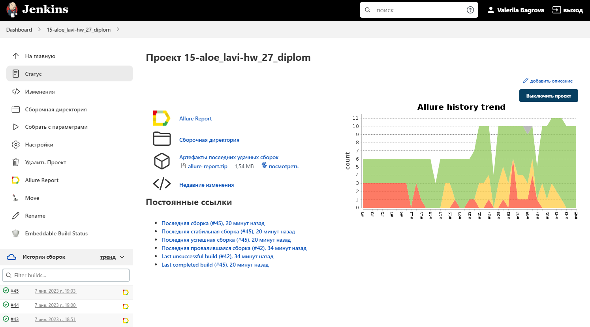
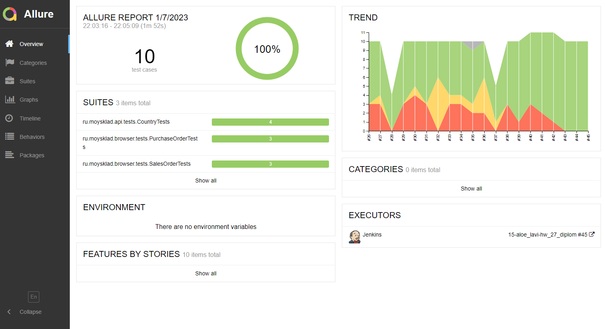
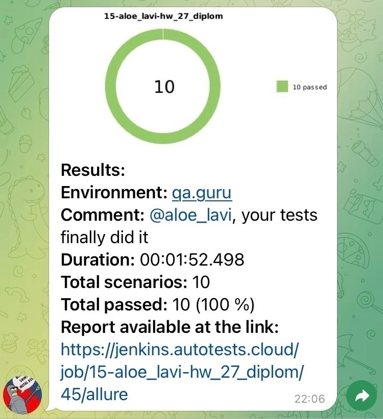

# Проект по автоматизации тестирования веб-приложения МойСклад

## :page_with_curl:	Содержание

- [Технологии и инструменты](#rocket-технологии-и-инструменты)
- [Реализованные проверки](#heavy_check_markреализованные-проверки)
- [Запуск тестов из терминала](#computer-запуск-тестов-из-терминала)
- [Allure отчет](#-allure-отчет)
- [Отчет в Telegram](#-уведомления-в-telegram-с-использованием-бота)
- [Видеопримеры прохождения тестов](#clapper-пример-видео-выполнения-теста-в-selenoid)

## :rocket: Технологии и инструменты

<p align="center">


</p>

## 	:heavy_check_mark:	Реализованные проверки

- WEB
  - Проверки документа "Заказ поставщику"
    - Создание документа
    - Копирование документа
    - Попытка создания без обязательных полей
  - Проверки документа "Заказ покупателя"
    - Создание документа
    - Копирование документа
    - Попытка создания без обязательных полей
- API
  - Проверки сущности "Страна"
    - Просмотр
    - Создание с обязательными полями
    - Создание со всеми доступными полями
    - Попытка создания без обязательных полей
    - Редактирование
    - Удаление (проверяется косвенно во всех тестах)


## 	:computer: Запуск тестов из терминала

### :house_with_garden:	Локальный запуск тестов

```
gradle clean test
```

### :earth_asia: Удаленный запуск тестов
```
clean
test
-Dbrowser=${browser}
-DbrowserVersion=${browserVersion}
-DbrowserSize=${browserSize}
-Dremote=${remoteUrl}
```

### :clipboard:	Параметры сборки

>
> <code>browser</code> – браузер, в котором будут выполняться тесты (_по умолчанию - <code>chrome</code>_).
>
> <code>browserVersion</code> – версия браузера, в которой будут выполняться тесты (_по умолчанию - <code>100</code>_).
>
> <code>browserSize</code> – размер окна браузера, в котором будут выполняться тесты (_по умолчанию - <code>1440x1080</code>_).
> 
> <code>remoteUrl</code> – адрес удаленного сервера, на котором будут запускаться тесты.

### </a>	Страница сборки в Jenkins
<p align="center">

</p>

## </a> Allure отчет

### Главная страница Allure-отчета
<p align="center">

</p>

### Страница отдельного теста

<p align="center">

</p>

## </a> Уведомления в Telegram с использованием бота

<p align="center">

</p>

## :clapper: Пример видео выполнения теста в Selenoid

> К каждому тесту в отчете прилагается видео. Пример такого видео:
<p align="center">
  
</p>

## :speech_balloon:	Примечания по реализации

- **В идеале:** нужно было бы создавать отдельный аккаунт для каждого теста, чтобы тесты были независимы.

- **Как сделано**: не хотелось мусорить в сервисе, поэтому я использовала один тестовый аккаунт для всех тестов.
  После каждого теста удаляются созданные данные, а также тесты не могут быть запущены параллельно.
